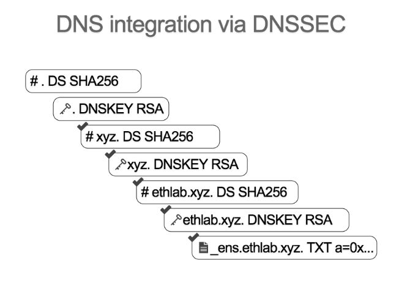

# DNS Registrar

DNSSEC (The Domain Name System Security Extensions) establishes a chain of trust from the root key which signed by ICANN (.) and down through each key. We start off knowing the hash of the root key of DNS (this is hard coded in the smart contract oracle). Given the hashes of that key, we can pass in the actual key, we can verify that it matches the hash and we can add it to the set of the trusted records.

Given that key, we can now verify any record that is signed with that key, so in this case, it’s the hash of the root of the xyz top level domain. Given that, we can recognize the key, and so on and so forth.



At ENS, we have two smartcontracts, [DNSSECOracle](https://github.com/ensdomains/dnssec-oracle) and [DNSRegistrar](https://github.com/ensdomains/dnsregistrar).
DNSSEC oracle allows anyone to submit proof of any DNSSEC-signed DNS record on the Ethereum blockchain, as long as it was signed using supported public key schemes and digests. DNSRegistrar grants ENS domains to anyone who can prove ownership of the corresponding domain in DNS through DNSSEC Oracle to prove this.

## Deployed DNSRegistrar addresses

- Mainnet, at TBD.
- Ropsten, at 0x475e527d54b91b0b011DA573C69Ac54B2eC269ea.
- Rinkeby, at TBD.
- Goerli, at TBD.

When you register ENS names, you can look up the registrar contract address by looking up its parent domain owner (eg: `.eth`, for `.matoken.eth`). However, when you register via DNSSEC Registrars, the parent domain owner may not exist if you are the first person to register under the TLD.

## Gas cost.

Submitting proof to DNSSEC Oracle takes up a lot of gas because it is heavy computation work. It will take up even more gas if you submits tge first domain under the specific TLD. This is because it submits proof on both your domain and its parent domain(eg: `matoken.live`, as well as `.live`). When tested on Ropsten network, [it costed 1,663,953 gas](https://ropsten.etherscan.io/tx/0x7ba91728530b2a9f325b330986265fd455639fd3f07e775cf68ee8c767b2637f)

## Typescript/Javascript Libraries

To help you interact with DNSSEC data and the DNSRegistrar, we provide two libraries.

- [DNSProvejs](https://github.com/ensdomains/dnsprovejs) = A library for querying and validating DNSSEC data from DNS
- [dnssecoraclejs](https://github.com/ensdomains/dnssecoraclejs) = A library for generating proof data for the ENS DNSSEC Oracle.

## Examples

### Retrieving proof from DNS

```javascript
import { Oracle } from '@ensdomains/dnssecoraclejs'
import { DNSProver } from '@ensdomains/dnsprovejs'

const textDomain = '_ens.matoken.xyz'
const prover = DNSProver.create("https://cloudflare-dns.com/dns-query")
const result = await prover.queryWithProof('TXT', textDomain)
```

### Retrieving the DNS text record

```javascript
const result = {
  answer: SignedSet {
    records: [{
      name: '_ens.matoken.xyz',
      type: 'TXT',
      ttl: 300,
      class: 'IN',
      flush: false,
      data: [Array]
    }],
    signature: {
      name: '_ens.matoken.xyz',
      type: 'RRSIG',
      ttl: 300,
      class: 'IN',
      flush: false,
      data: [Object]
    }
  },
  proofs: [
    SignedSet { records: [Array], signature: [Object] },
    SignedSet { records: [Array], signature: [Object] },
    SignedSet { records: [Array], signature: [Object] },
    SignedSet { records: [Array], signature: [Object] },
    SignedSet { records: [Array], signature: [Object] }
  ]
}

// Retrieving the text record
result.answer.records[0].data.toString()
// 'a=0xa5313060f9fa6b607ac8ca8728a851166c9f612'
```

### Submitting the proof to the DNSRegistrar

```javascript
import { Oracle } from '@ensdomains/dnssecoraclejs'
import { abi } from '@ensdomains/contracts/abis/dnsregistrar/DNSRegistrar.json'
import { Contract } from 'ethers'

// The registrar address nees to be hard-coded
const registrarAddress = '0x475e527d54b91b0b011DA573C69Ac54B2eC269ea'
const registrar new Contract(registrarAddress, abi, provider)
const oracleAddress = await registrar.oracle()
const oracle = new Oracle(oracleAddress, provider)
const { data, proof } = oracle.getProofData(result)

if(data.length === 0){
    // This happens if someone has submitted the proof directly to DNSSECOracle, hence only claim a name on the registrar.
    return registrar.claim(claim.encodedName, proof)
}else{
    // This submits proof to DNSSECOracle, then claim a name.
    return registrar.proveAndClaim(claim.encodedName, data, proof)
}
```

## Todo

It is currently missing the Typescript/JS library support to delete the record from DNSSECOracle by providing NSEC/NSEC3(Next Secure Record) proof.
